# Perception SLM — Master Plan (Detailed + Diagrams)

**Project:** Small, from-scratch multimodal **understanding** models — Image, Video, Audio.
**Not generation.** Input = pixels / frames / sound → Output = meaning (text, labels, structured JSON, answers).
**Goal:** The most **efficient** small perception models in the world — fast on a $30 chip, private enough for a hospital, cheap enough for a billion calls. On-device first, cloud second. Global.

> **Diagrams render on GitHub and in IDE markdown previewers with Mermaid support.**
> If a diagram shows as raw text, install a Mermaid preview extension, or ask me to publish this as a rendered web page.

---

## Table of contents
1. [The problem](#1-the-problem--what-we-solve)
2. [Pros & cons](#2-pros--cons)
3. [System architecture (big picture)](#3-system-architecture--big-picture)
4. [Each component in depth](#4-each-component-in-depth)
5. [Tech stack — offline / online / cloud](#5-tech-stack--offline--online--cloud)
6. [System design (deployment planes)](#6-system-design--deployment-planes)
7. [Issues & optimization](#7-issues--how-we-optimize)
8. [Datasets (HuggingFace-first)](#8-datasets--huggingface-first)
9. [Roadmap: install → deploy](#9-roadmap--install--deploy)
10. [Repo & test structure](#10-repo--test-structure)

---

## 1. The problem — what we solve

"Understanding" an image/video/audio today = calling a **giant cloud model**. For a real product that means **cost + latency + privacy** pain. Compare the two paths:

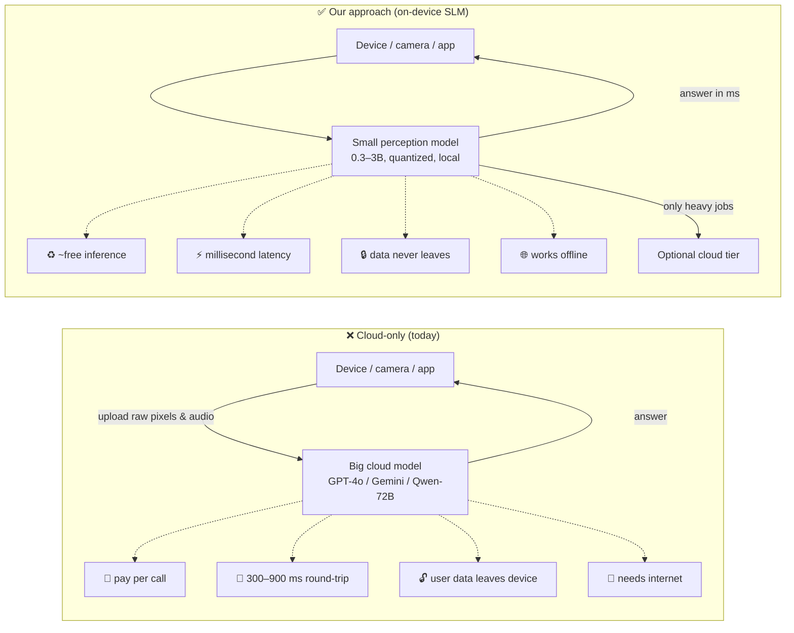

**Thesis:** small models (~0.3B–3B params), specialized for perception, quantized, running **on the device** — with an optional cloud tier for heavy/batch work. Small + on-device removes cost, latency, and privacy pain simultaneously.

---

## 2. Pros & cons

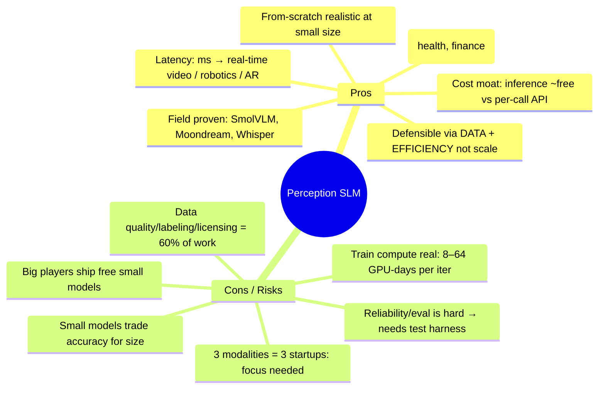

**Bottom line:** you don't win on size. You win on **(a) proprietary task data** and **(b) being the best at running tiny + on-device**. Everything below optimizes for those two.

---

## 3. System architecture — big picture

**Three separate models, one shared core.** Never force one backbone across pixels + frames + sound — it hurts quality. Share the **decoder + tooling**, not the encoders.

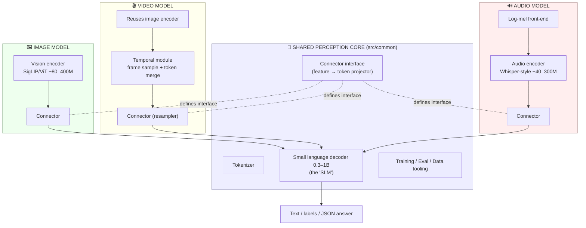

**Why separate:** Image = spatial only (smallest, fastest to SOTA). Video = image encoder **+ time** (built on top of image). Audio = a totally different encoder (independent, parallelizable).
**What's genuinely "from scratch":** the **connector** (and optionally the decoder). Encoders can be from-scratch *or* init-from-open-weights then re-trained — a budget call (§9).

---

## 4. Each component in depth

### 4.1 Image model — data flow

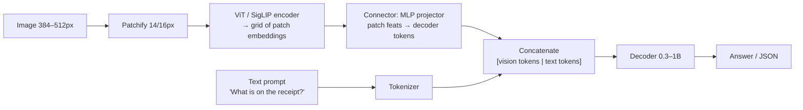
- **Encoder target:** ~80–400M params, patch 14/16, 384–512px input.
- **From scratch:** SigLIP contrastive pretrain on web image-text. **Shortcut:** open SigLIP weights + finetune.
- **First to build** (Phase 2) — its encoder is reused by video.

### 4.2 Video model — the time dimension (where efficiency lives)

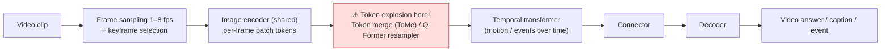
- **Core risk:** N frames × M patches = token blow-up → OOM + slow. Fix with frame subsampling, keyframe selection, token merging, resampler.
- Built **on top of** the image encoder → image comes first even under an "audio+video first" preference.

### 4.3 Audio model — independent pipeline

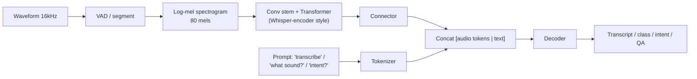
- Understanding, **not just transcription**: sound-event classes, emotion, intent, audio Q&A.
- Fully independent → can be built **in parallel** by a second contributor from day one.

### 4.4 The connector — where OUR data becomes the moat

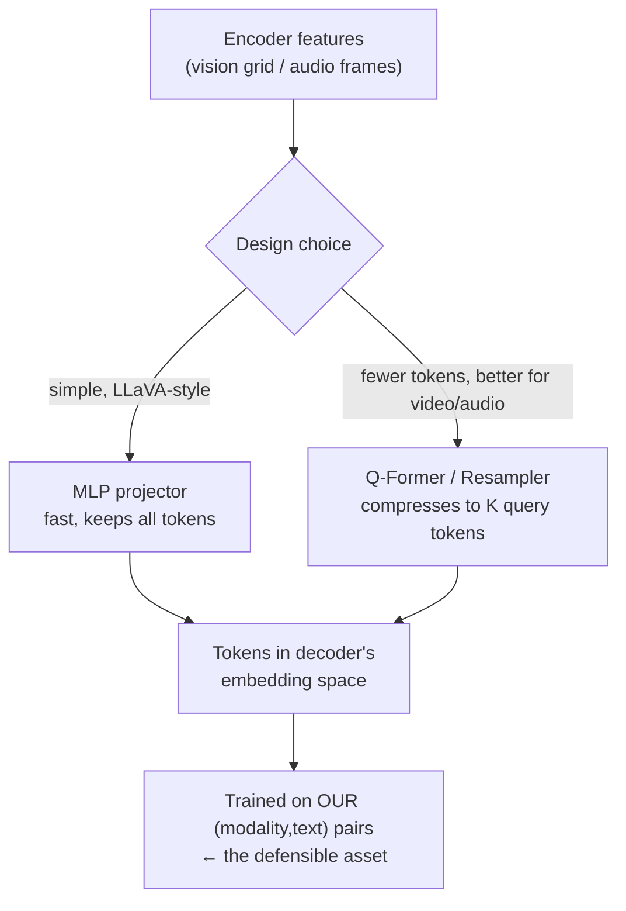

### 4.5 Training stages (curriculum)

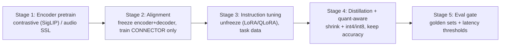

### 4.6 The decoder (the "SLM")
- 0.3–1B decoder-only transformer. **From scratch** feasible at this size, or continue-train an open small LM (SmolLM2, Qwen2.5-0.5B/1.5B, Llama-3.2-1B).
- Shared across all three models. Supports **constrained/JSON decoding** for structured extraction.

---

## 5. Tech stack — offline / online / cloud

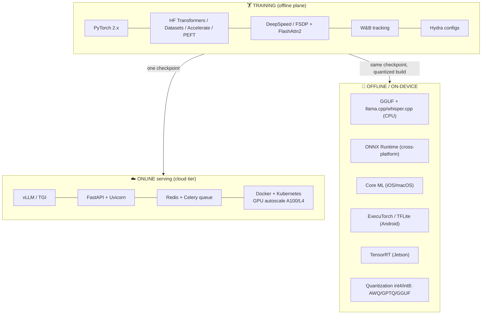

| Layer | Offline / on-device | Online (cloud) | Cloud infra |
|---|---|---|---|
| Runtime | GGUF, ONNX, Core ML, ExecuTorch, TensorRT | vLLM / TGI | RunPod/Lambda (early) → AWS/GCP |
| Quantize | int4/int8 (AWQ, GPTQ, GGUF) | fp16/int8 | — |
| Storage | on-device file | — | S3 / GCS (data + checkpoints) |
| Data source | — | — | **HuggingFace Hub (streamed)** |
| CI/CD | — | GitHub Actions → test + build + push | model registry (HF private) |

---

## 6. System design — deployment planes

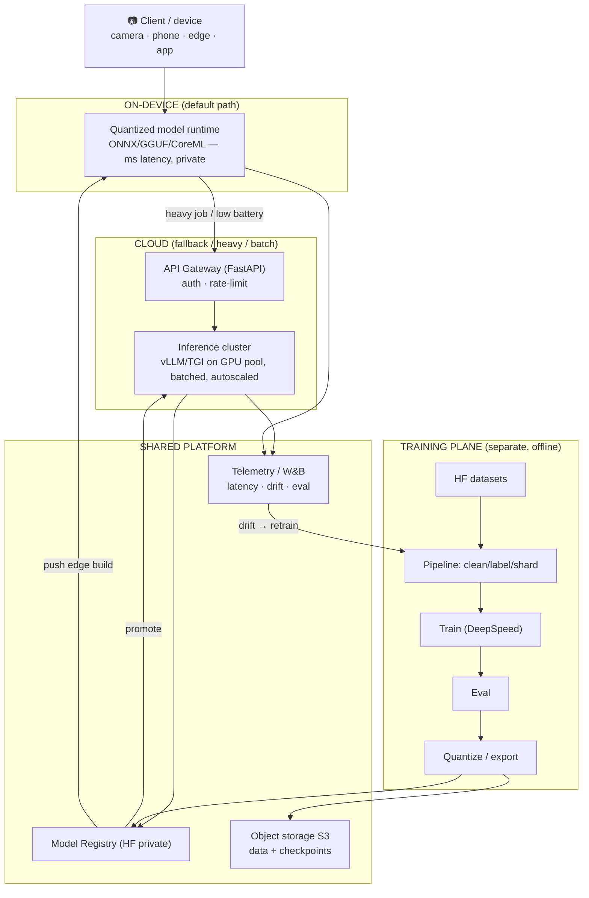

**Principles:** device-first + cloud-fallback · one checkpoint → two builds · data version + model version + eval report always travel together · shadow-test before promoting.

---

## 7. Issues & how we optimize

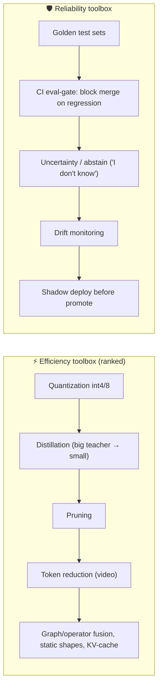

| Problem | Symptom | Fix |
|---|---|---|
| Video token explosion | OOM, slow | frame subsample, keyframe, token merge (ToMe), resampler |
| Quantization accuracy drop | int4 gets dumb | quant-aware training, mixed 4/8-bit, per-channel, keep sensitive layers high-precision |
| Hallucination | invents unseen text | grounding loss, hard negatives, abstain training, constrained/JSON decode |
| Small model underfits | mediocre everywhere | **distillation** from big teacher, curriculum (easy→hard) |
| Data noise | unstable training | dedup, CLIP-score filter, consensus labels, clean held-out set |
| Field drift | demo works, field fails | collect field data, drift telemetry, periodic retrain |
| Weak-HW latency | too slow on phone | distill smaller, ONNX graph opt, fusion, static shapes |
| Regressions | new model breaks old cases | golden sets + CI eval gate (§10) |
| Audio robustness | fails on noise/accents | SpecAugment, diverse data, VAD front-end |

---

## 8. Datasets — HuggingFace-first ✅

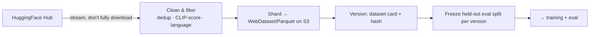

| Modality | Pretrain / align | Instruction / task |
|---|---|---|
| **Image** | LAION subsets, COCO Captions, CC3M/CC12M, SBU, DataComp | LLaVA-Instruct, VQAv2, GQA, TextVQA, DocVQA, OCR-VQA, ChartQA, AI2D, FUNSD |
| **Video** | WebVid, HowTo100M | MSR-VTT, ActivityNet-Captions, NExT-QA, VATEX, Something-Something-v2, Ego4D |
| **Audio** | LibriSpeech, Common Voice, GigaSpeech, VoxPopuli, People's Speech | AudioSet, ESC-50, FSD50K, UrbanSound8K, AudioCaps, Clotho, WavCaps |

> Always verify dataset **licenses** before commercial use.

---

## 9. Roadmap — install → deploy

```mermaid
gantt
    title Perception SLM roadmap (weeks)
    dateFormat  X
    axisFormat  W%s
    section Setup
    Phase 0 env + toy smoke test        :p0, 0, 1
    Phase 1 reproduce tiny VLM          :p1, 1, 2
    section Models
    Phase 2 IMAGE model v0 (first)      :p2, 3, 5
    Phase 3 AUDIO model v0 (parallel)   :p3, 5, 4
    Phase 4 VIDEO model v0 (reuses img) :p4, 8, 5
    section Ship
    Phase 5 serving online+offline      :p5, 11, 5
    Phase 6 optimize + harden           :p6, 13, 6
    Phase 7 deploy cloud + edge SDK     :p7, 16, 4
```

**Phase gates (must pass to advance):**

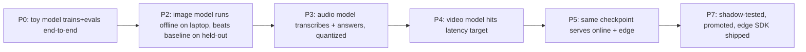

**Sequencing note (your "audio + video first" preference):** Audio is independent → start **in parallel immediately**. Video needs the image encoder → we build Image first (fast, ~2 wks work) so Video reuses it. You still get audio + video early.

---

## 10. Repo & test structure

Every functional **section** has its own **source folder** and a **mirrored test folder** (`test_<name>`). Tests are first-class — reliability *is* the product.

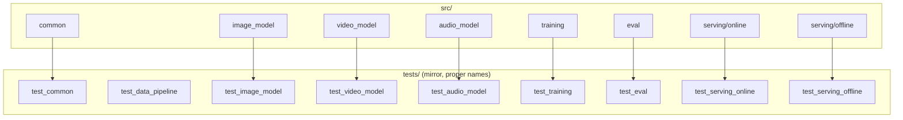

**Test tiers (run in CI on every PR):**

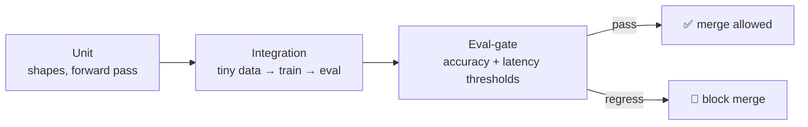

**Directory tree:**
```
img_video_audio/
├── MASTER_PLAN.md · README.md · requirements.txt · .gitignore · pyproject.toml
├── configs/                      # Hydra/YAML per model & experiment
├── data/{raw, processed, pipelines}
├── src/
│   ├── common/                   # tokenizer, connector, decoder, utils
│   ├── image_model/  video_model/  audio_model/
│   ├── training/  eval/
│   └── serving/{online, offline}
├── tests/test_{common,data_pipeline,image_model,video_model,
│               audio_model,training,eval,serving_online,serving_offline}/
├── deploy/{docker, cloud, edge}
├── notebooks/  scripts/
```

---

## Next steps
1. Review these diagrams / depth — tell me what to expand further.
2. I scaffold starter code for `src/common` + `src/image_model` (encoder→connector→decoder skeleton + tests).
3. Phase 0: environment + toy end-to-end smoke test.

*Want this as a rendered, shareable web page (interactive diagrams)? Ask and I'll publish it as an artifact.*
